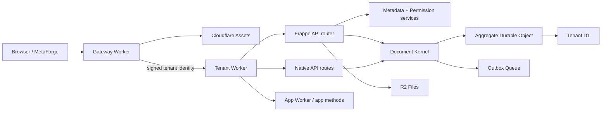
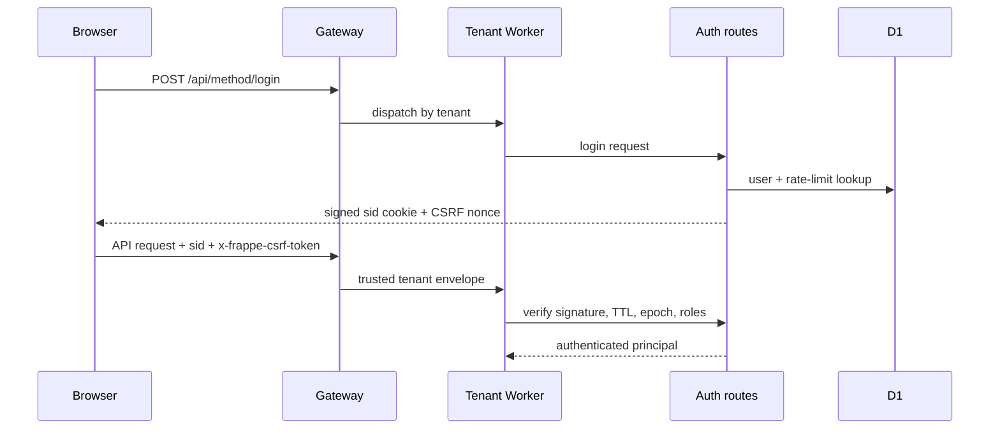
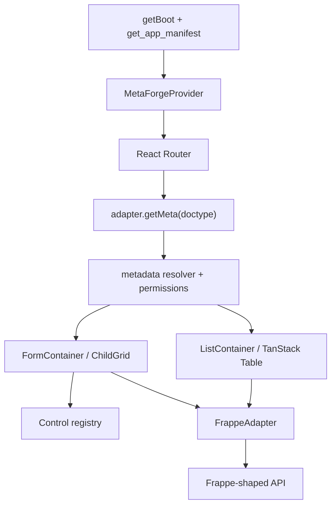
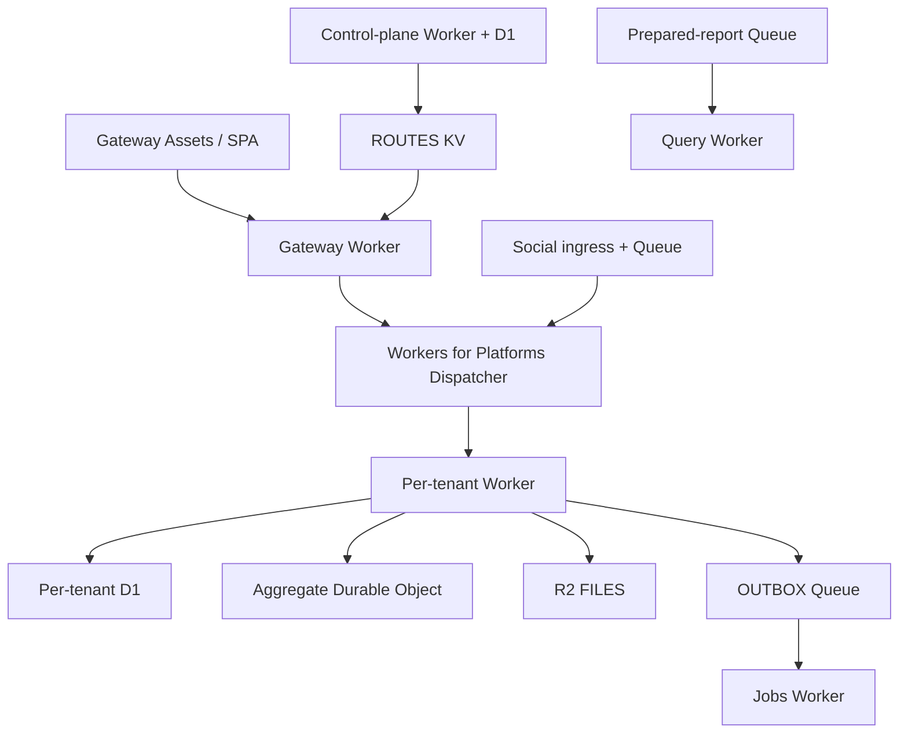

# ARCHITECTURE

## Cây thư mục rút gọn

```text
C:\Forge-r6
├─ client/
│  ├─ apps/runtime/                 # SPA production chung
│  ├─ apps/demo|sample-sales|sample-wms/  # demo/sample apps
│  ├─ packages/
│  │  ├─ adapter-frappe/            # API boundary
│  │  ├─ core/                      # types, metadata resolver
│  │  ├─ controls|ui|views/         # render controls/list/form
│  │  ├─ builder/                   # metadata builder
│  │  └─ shell/                     # app shell, auth, navigation
│  └─ scripts/
├─ server/
│  ├─ apps/
│  │  ├─ gateway-worker/
│  │  ├─ tenant-worker/
│  │  ├─ query-worker/
│  │  ├─ jobs-worker/
│  │  └─ control-plane-worker/
│  ├─ packages/                     # kernel, API, model, services
│  ├─ migrations/{tenant,control,jobs}/
│  ├─ briefs/                       # app manifests/metadata
│  ├─ scripts/                      # build, install, migrate, deploy
│  └─ tests/
├─ docs/
├─ package.json
└─ pnpm-workspace.yaml
```

`server/apps-src` và `server/apps/social-ingress-worker` từng chứa app nghiệp vụ riêng của khách
(Alumdoor) và social commerce — đã gỡ khi bóc lõi. Nếu thấy tài liệu cũ nhắc tới chúng, đó là
tàn dư trước lúc bóc.

Các thư mục `node_modules`, `dist`, `build`, `.git`, `coverage`, `server/work` và `tmp` là dependency/generated/cache, không phải nguồn kiến trúc.

## Entry points và router

| Lớp | Entry point | Vai trò |
|---|---|---|
| Frontend | `client/apps/runtime/src/main.tsx` | Tạo adapter, auth/manifest boundary, provider và React Router |
| Gateway | `server/apps/gateway-worker/src/index.ts` | Host routing, Assets, trusted identity, dispatch |
| Tenant | `server/apps/tenant-worker/src/index.ts` | Native routes, Frappe facade, internal routes |
| Frappe router | `server/packages/frappe-api/src/router.ts` | `/api/resource/*`, `/api/method/*`, CRUD/workflow/report/print |
| Query | `server/apps/query-worker/src/index.ts` | Prepared/report query workload |
| Jobs | `server/apps/jobs-worker/src/index.ts` | Queue và scheduled maintenance |
| Control plane | `server/apps/control-plane-worker/src/index.ts` | Tenant routing/provisioning state |

Frontend routes được khai báo trực tiếp trong `client/apps/runtime/src/main.tsx`, gồm list/form/new/print/report/workspace/overview/catalog/permissions/import/action screen. Bản in dùng `/print/:doctype/:name?format=<tên mẫu>`; runtime tải danh sách mẫu đã bật cho chứng từ, chọn mẫu mặc định khi URL không chỉ định và giữ mẫu phụ trong query string.

## Request và service layers



- **API layer:** tenant Worker + `server/packages/frappe-api/src/router.ts`.
- **Service layer:** `server/packages/frappe-api/src/services/`, `server/packages/query/`, `server/packages/app-registry/` và domain packages.
- **Data access:** `server/packages/document-kernel/src/d1-store.ts`, `server/packages/frappe-model/src/store.ts` và package ledger/query stores.
- **Write path:** router → controller/validator → document kernel → Durable Object → D1 + outbox.
- **Read path:** router/service → D1 session; bookmark được trả về để client có read-your-writes.

## Database schema

Migration là nguồn sự thật:

- Tenant: `server/migrations/tenant/0001_core.sql` đến `0124_core_maintenance_and_period_lock_events.sql`.
- Control plane: `server/migrations/control/`.
- Jobs: `server/migrations/jobs/`.

Nhóm bảng chính còn lại sau khi bóc lõi:

- Documents/lifecycle: `documents`, `document_children`, `versions`, mutation guard/receipts.
- Metadata: doctype definitions, custom fields, property setters, workflows, print formats.
- Auth/permission: users, roles, user roles, user permissions, shares.
- Platform: installed apps, app objects/hooks, files, imports, notifications, auto-repeat.
- Bảo trì: `maintenance_runs`, `accounting_period_lock_events` (dựng lại ở `0124` sau khi bóc,
  xem ghi chú trong chính migration đó).

Chuỗi 85 migration giữ nguyên số thứ tự vì chúng phụ thuộc nhau; một số bảng thuộc ERP domain
đã gỡ vẫn còn được `CREATE TABLE` bởi migration cũ và nằm im, không code lõi nào đọc chúng.
Không sửa migration cũ đã có khả năng chạy production; thêm migration mới và test upgrade path.

## Authentication flow



Chi tiết nằm ở `server/packages/frappe-api/src/session.ts` và `auth-routes.ts`. Native API dùng Bearer JWT; internal Gateway/app callbacks dùng HMAC envelope khác với user session.

## Authorization flow

`server/packages/frappe-model/src/permission.ts` kết hợp DocPerm metadata, role, permlevel, owner, share và user permission. Router redacts document/metadata khi đọc và assert quyền khi ghi. Frontend resolver chỉ phục vụ presentation; không thay thế server authorization.

## State management

- Server state/cache: TanStack Query trong các container frontend.
- Runtime context: `MetaForgeProvider` tại `client/packages/views/src/container/provider.tsx`.
- Auth/session: `AuthBoundary` và adapter.
- View state: React hooks, URL query string cho list/filter/page/selection, localStorage cho một số layout/preference.
- Không dùng Redux.

## Form/list và metadata loading



Manifest parser/server model nằm tại `server/packages/app-registry/src/manifest.ts`; frontend validation/loading bắt đầu từ `client/apps/runtime/src/main.tsx`.

## File upload

Frontend gọi `uploadFile` trong `client/packages/adapter-frappe/src/frappe-adapter.ts`. Frappe router nhận upload/file endpoints, lưu metadata File trong D1 và binary qua binding `FILES` (R2) của tenant Worker. Truy cập file phải đi qua facade để áp dụng tenant/session/permission.

## Build flow

1. `pnpm.cmd run typecheck`
2. `pnpm.cmd run build`
3. Server TypeScript build.
4. Client packages/apps build bằng TypeScript/Vite.
5. Runtime production được stage bởi `server/scripts/stage-client-bundle.mjs` vào Assets của Gateway khi chạy release flow.
6. App brief được compile/verify bằng `server/scripts/forge-app.mjs` và các script build brief tương ứng.

Root scripts và release gates nằm trong `package.json`; chi tiết server/client nằm trong `server/package.json` và `client/package.json`.

## Deployment flow

- Gateway: Wrangler config `server/apps/gateway-worker/wrangler.jsonc`; deploy sau khi stage client bundle.
- Tenant: dùng `server/scripts/deploy-tenant.mjs`, không dùng config tenant chung để tránh bind nhầm D1.
- Tenant mới: `server/scripts/provision-tenant.mjs` chạy migration, deploy dispatch Worker, thiết lập secret/route/admin.
- Remote D1 migration: `server/scripts/d1-migrate-remote.mjs`.
- Các Worker khác có `wrangler.jsonc` riêng dưới `server/apps/*`.



Repo hiện không dùng Cloudflare Pages như một project frontend độc lập; SPA được phục vụ bằng Workers Assets của Gateway. Không ghi resource ID hoặc secret thật vào tài liệu hay cấu hình mẫu.
