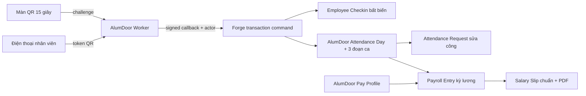

# AlumDoor — Thiết kế kỹ thuật chấm công QR và tính lương đơn giản

- Ngày khóa thiết kế: 2026-08-10
- Trạng thái: Cổng 3 — Slice 1 đang triển khai metadata, QR và công ngày; chưa apply tenant metadata
- BRD nguồn: `docs/ALUMDOOR-CHAM-CONG-TINH-LUONG-BRD-20260810.md`
- Field Ledger nguồn thi công: `docs/ALUMDOOR-CHAM-CONG-TINH-LUONG-FIELD-LEDGER-20260810.md`
- Phạm vi: tenant AlumDoor; tái sử dụng HRM/Payroll chuẩn của Forge

## 1. Kết luận kiến trúc

Module không tạo một CRUD chấm công/lương song song. Nó gồm bốn lớp:

1. **Bề mặt AlumDoor tinh gọn**: các màn Experience riêng cho quét QR, công hôm nay, bảng công, ngoại lệ và chạy lương.
2. **AlumDoor Worker**: phát/xác minh QR 15 giây, điều phối công thức ca và các lệnh nghiệp vụ `alumdoor.attendance.*`, `alumdoor.payroll.*`.
3. **Lệnh giao dịch nền tảng**: một callback nội bộ, chỉ Worker AlumDoor được gọi, ghi `Employee Checkin` và cập nhật `AlumDoor Attendance Day` cùng ba child row trong một transaction D1. Không ghép nhiều REST write rời rạc ở client.
4. **Ranh giới DocType**: `Employee` chỉ cung cấp identity/scope; `Employee Checkin` là log gốc bất biến; `AlumDoor Attendance Day` là nguồn công ba ca và nguồn lương tương lai. `Attendance` chuẩn HRM không được dùng cho thuật toán ba ca. Các overlay chuẩn khác chỉ là pha sau, có ledger/duyệt riêng.

Không thêm D1 binding riêng cho `alumdoor-worker`; Worker tiếp tục không giữ dữ liệu tenant. Secret ký QR là Worker secret, còn dữ liệu và quyền nằm trong tenant database.

## 2. Những gì tái sử dụng và những gì bổ sung

| Contract nghiệp vụ | Triển khai kỹ thuật | Loại thay đổi |
|---|---|---|
| `attendance_policy` | `AlumDoor Attendance Policy` | Custom DocType tenant AlumDoor |
| `attendance_qr_station` | `AlumDoor QR Station` | Custom DocType tenant AlumDoor |
| `employee_checkin` | `Employee Checkin` | Tái sử dụng + Custom Fields `alu_*`; log QR submit ngay và bất biến |
| `attendance_segment` | `AlumDoor Attendance Segment` | Child DocType trong `AlumDoor Attendance Day` |
| `attendance_day` | `AlumDoor Attendance Day` | Custom DocType, projection ngày và nguồn công cho lương |
| `attendance_correction_request` | `Attendance Request` | Pha sau: tái sử dụng + Workflow/Custom Fields `alu_*` |
| `employee_pay_profile` | `AlumDoor Pay Profile` | Pha sau: Custom DocType nhẹ, không bật form Salary Structure Assignment nặng |
| `payroll_period` | `Payroll Entry` | Pha sau: tái sử dụng + workflow/custom fields `alu_*` |
| `salary_slip` | `Salary Slip` | Pha sau: tái sử dụng + component/trace Custom Fields `alu_*` |

`Shift Type`, `Shift Assignment` và `Attendance` hiện có vẫn giữ nguyên cho HRM chung. Chính sách AlumDoor khóa ba đoạn ca trong một phiên bản hiệu lực vì controller `Attendance` chuẩn chỉ có một cặp `in_time/out_time`, không đủ biểu diễn ba đoạn và hai khoảng nghỉ. Vì vậy không sửa/mở rộng controller chung đó cho đường QR AlumDoor.

**Ranh giới Slice 1:** cài bốn DocType custom (Policy, QR Station, Segment, Attendance Day) cùng overlay `alu_*` trên `Employee Checkin`. `Employee` không có custom field. Nếu mở rộng sau này, năm DocType chuẩn có thể có overlay khi ledger được duyệt: `Employee Checkin`, `Attendance` (chỉ projection tương thích, không là nguồn ba ca), `Attendance Request`, `Payroll Entry`, `Salary Slip`.

## 3. Quyết định kỹ thuật bắt buộc

### ADR-ATT-001 — Giờ server là nguồn duy nhất

- Client chỉ gửi token QR và fingerprint hash tùy chọn.
- `scan_time`, `work_date`, segment, IN/OUT đều do server quyết định.
- Không nhận giờ điện thoại, không queue scan offline, không cho client chọn nhân viên.
- Timezone mặc định `Asia/Ho_Chi_Minh`, đọc từ policy đã duyệt.

### ADR-ATT-002 — QR stateless theo time bucket

- Bucket = `floor(server_epoch_seconds / qr_ttl_seconds)`.
- Nonce được dẫn xuất bằng HMAC từ `tenant + station + bucket + secret_version`; cùng một trạm trong cùng bucket nhận cùng challenge.
- Chữ ký HMAC bao phủ toàn payload; so sánh constant-time.
- Token không chứa employee, không chứa secret, không dùng ID tăng dần.
- `external_id` của checkin = hash chuẩn hóa của `tenant + employee + station + nonce + segment`; unique hiện có chống ghi lặp.
- Cho lệch đồng hồ chỉ theo server bucket hiện tại và bucket liền trước nếu `expires_at` chưa qua; không mở cửa sổ dài hơn TTL.

### ADR-ATT-003 — Một lệnh giao dịch cho một lần quét

`alumdoor.attendance.scan` không tự tạo nhiều document qua các callback rời. Sau khi xác minh QR, Worker gọi callback nội bộ `metaforge.api.commit_alumdoor_attendance_scan` với app identity đã ký. Callback thực hiện trong một transaction:

1. khóa logic theo `tenant + actor.user_id`; actor được map server-side sang đúng một Employee, nên mọi scan của cùng người được tuần tự hóa trước khi cập nhật `AlumDoor Attendance Day`;
2. kiểm tra lại employee/station/policy và trạng thái `AlumDoor Attendance Day`;
3. insert `Employee Checkin` bằng `external_id` unique;
4. upsert đúng child segment;
5. tính lại tổng `AlumDoor Attendance Day`;
6. ghi audit/outbox;
7. commit và trả snapshot hôm nay.

Nếu `external_id` đã tồn tại, transaction trả lại kết quả gốc với `idempotent=true`; không đảo IN thành OUT. `AlumDoor Attendance Day` đã `locked` trả 409 và hướng dẫn phiếu điều chỉnh kỳ sau.

### ADR-ATT-004 — Công thức theo từng đoạn, không toggle toàn ngày

- Ca 1 nhận quét 05:30–12:29, phút tính công là giao với 07:00–11:30.
- Ca 2 nhận quét 12:30–17:29, phút tính công là giao với 13:00–17:00.
- Ca 3 nhận quét 17:30–23:59, toàn bộ giao với 17:30–23:59 là OT.
- Mỗi đoạn độc lập `empty → open → complete`; thiếu OUT ca trước không đổi chiều ca sau.
- Ca 1 + ca 2 có tối đa 480 phút thường; phần vượt 480 là OT.
- Không tính khoảng nghỉ 11:30–13:00 và 17:00–17:30.
- Không tự bịa OUT, không tự tính ca qua đêm.

### ADR-PAY-001 — Tiền số nguyên và snapshot bất biến

- Tất cả custom field tiền lưu số nguyên VND; không dùng `REAL` làm nguồn tính.
- Hệ số OT lưu basis points: `15000 = 1,5 lần`.
- Tỷ lệ ngày công lưu basis points: `10000 = 1 ngày công`.
- Mỗi Salary Slip lưu `formula_trace_json`, `input_hash`, `calculation_version`.
- `pending_approval` khóa input; nếu dữ liệu nguồn đổi trước khi duyệt, hash lệch thì kỳ thành `invalidated`, buộc tính lại.
- `approved/paid` không update tiền; sửa bằng kỳ điều chỉnh mới.

### ADR-PAY-002 — Kỳ lương dùng Payroll Entry chuẩn

`Payroll Entry` là aggregate kỳ. Lệnh tính tạo/cập nhật Salary Slip draft bằng khóa duy nhất `period + employee`. Lệnh gửi duyệt đóng băng trace. Lệnh duyệt chạy preflight rồi submit toàn bộ slips và entry trong transaction coordinator; lỗi ở một phiếu rollback toàn bộ. `Đã trả` chỉ ghi dấu thanh toán trong MVP, không tự tạo bút toán.

## 4. Ràng buộc dữ liệu và index

Nền tảng vật lý tiếp tục dùng `documents`, `child_rows`, `doctype_definitions`; bảng dưới là ràng buộc logic phải được metadata/controller và migration guard đảm bảo.

| Đối tượng | Unique/index bắt buộc | Cách bảo vệ |
|---|---|---|
| Attendance Policy | policy được trạm tham chiếu + khoảng hiệu lực | Slice 1 chỉ kiểm tra policy `approved` và còn hiệu lực lúc scan; validator cấm các policy approved chồng hiệu lực là hạng mục pha sau, chưa được controller/metadata hiện tại thực thi |
| QR Station | `station_code` trong tenant | Custom Field unique; code counter `QR` |
| Employee Checkin | `external_id` | unique hiện có; QR log không có update/cancel/delete |
| AlumDoor Attendance Day | `employee + work_date` | custom controller/upsert cấm duplicate ngày |
| Segment | `parent AlumDoor Attendance Day + segment_code` | transaction controller cấm duplicate child row |
| Attendance Request | `request_code` | autoname/counter chuẩn `YC`; một request pending cho cùng employee/date/segment |
| Pay Profile | `employee + effective_from + version` | `profile_key` unique; validator cấm approved overlap |
| Payroll Entry | `company + branch + start_date + end_date` với state active | `alu_period_key` unique; cancelled có version mới |
| Salary Slip | `payroll_entry + employee` | unique guard hiện có/bổ sung index payload nếu thiếu |

### 4.1 Dự thảo migration — chưa thực thi

Migration triển khai ở Pha 5 theo thứ tự:

1. đăng ký role `AlumDoor QR Station`, `AlumDoor Attendance Manager`, `AlumDoor Payroll User`, `AlumDoor Payroll Approver`;
2. Slice 1 tạo ba DocType master/transaction: Policy, QR Station, Attendance Day; tạo child DocType Segment;
3. Slice 1 chỉ thêm Custom Fields `alu_*` vào `Employee Checkin`; không chỉnh `Employee` hoặc `Attendance` chuẩn;
4. thêm Workflow/Workflow State/Property Setter/Print Format/Workspace shortcut riêng tenant `alu`;
5. thêm unique/index guard còn thiếu trên JSON payload bằng migration tenant idempotent;
6. cài một policy nháp đúng bảy mặc định BRD, Owner mở setup và bấm duyệt; actor/thời gian/before-after được lưu trên workflow/audit timeline, không tạo cột approval riêng trên Policy;
7. chạy backfill chỉ để tạo `AlumDoor Attendance Day` draft từ checkin cũ khi người vận hành chủ động chọn khoảng; mặc định không tự sửa lịch sử;
8. cung cấp script dry-run mặc định và `--apply --tenant alu`; chạy lần hai không tạo bản ghi trùng.

Không sửa base JSON của `Employee`, `Attendance`, `Salary Slip` để tránh làm các tenant khác hiện trường AlumDoor. Nếu cần projection `Attendance` tương thích HRM ở pha sau, nó phải có controller/ledger riêng và không thay thế `AlumDoor Attendance Day`.

## 5. Thuật toán chấm công

### 5.1 Xác định segment

1. Chuyển `server_now` sang timezone của policy.
2. Tính phút trong ngày.
3. 05:30–12:29 → `SHIFT1`; 12:30–17:29 → `SHIFT2`; 17:30–23:59 → `SHIFT3`.
4. Ngoài ba cửa sổ trả `ATTENDANCE_OUTSIDE_WINDOW`, không ghi dữ liệu.
5. Trong segment: chưa có IN → IN; có IN chưa OUT → OUT; đủ hai log → `ATTENDANCE_SEGMENT_COMPLETE` 409.

### 5.2 Tính phút

`overlap(a,b,c,d) = max(0, min(b,d) - max(a,c))`, tất cả tính bằng integer minute.

- `shift1_actual = overlap(actual_in, actual_out, 07:00, 11:30)`.
- `shift2_actual = overlap(actual_in, actual_out, 13:00, 17:00)`.
- `day12 = shift1_actual + shift2_actual`.
- `regular = min(day12, 480)`.
- `overtime_excess = max(day12 - 480, 0)`.
- `shift3_overtime = overlap(actual_in, actual_out, 17:30, 23:59)`.
- `overtime = overtime_excess + shift3_overtime`.
- `work_fraction_bp = round_half_up(regular * 10000 / 480)`; tối đa 10000/ngày.

Mốc giây được giữ trong trace nhưng phút công làm tròn xuống theo từng cặp hoàn chỉnh để không trả quá thời gian thực tế. Phút OT không tự làm tròn lên.

### 5.3 Ngoại lệ

| Mã | Khi nào | Xử lý |
|---|---|---|
| `MISSING_IN` | Có OUT điều chỉnh nhưng không có IN | `exception`, chặn lương |
| `MISSING_OUT` | Segment còn open sau cuối ngày | `exception`, chặn lương |
| `OUTSIDE_WINDOW` | Log/import ngoài cửa sổ | Không tự gán; cần request |
| `CROSS_DAY` | OUT khác work_date | Không tính; request |
| `POLICY_MISSING` | Không có policy approved hiệu lực | Fail closed |
| `DUPLICATE_TOKEN` | Cùng employee/token/segment | Trả kết quả cũ, không tạo lỗi ngày |
| `LOCKED_BY_PAYROLL` | AlumDoor Attendance Day đã dùng trong kỳ approved/paid | Tạo adjustment kỳ sau |

Tác vụ cuối ngày chỉ chuyển segment `open → missing_out` và AlumDoor Attendance Day → `exception`; tuyệt đối không sinh OUT giả.

## 6. Thuật toán lương

### 6.1 Kiểm tra trước khi tính

Kỳ không được tính nếu có một trong các lỗi:

- khoảng ngày chồng kỳ active;
- `standard_work_days_bp <= 0`;
- nhân viên active thiếu Pay Profile approved đúng hiệu lực;
- profile thiếu `overtime_multiplier_bp`;
- AlumDoor Attendance Day `open/exception`, request pending hoặc projection chưa đồng bộ;
- AlumDoor Attendance Day đã khóa bởi kỳ khác;
- số tiền/tỷ lệ ngoài giới hạn hoặc trace schema không đúng phiên bản.

### 6.2 Fixed-point

- `daily_rate_num/daily_rate_den` được giữ dưới dạng phân số trong trace.
- Lương ngày: `base_pay = round_half_up(base_salary_vnd × sum_work_fraction_bp / 10000)`.
- Lương tháng: `daily_rate = base_salary_vnd / (standard_work_days_bp / 10000)` rồi nhân tổng ngày công.
- `hourly_rate = daily_rate / 8`.
- `overtime_pay = round_half_up(overtime_minutes × hourly_rate × overtime_multiplier_bp / (60 × 10000))`.
- `net_pay = base_pay + overtime_pay + allowance - advance - manual_deduction`.

Mỗi thành phần làm tròn half-up một lần về VND; net là tổng các integer đã làm tròn, không làm tròn lại.

### 6.3 Formula trace schema v1

Trace tối thiểu gồm: `schema_version`, timezone, policy id/version/hash, pay profile id/version/hash, period, standard work days, attendance ids + modified/version, regular/overtime minutes, work fraction, exact rational inputs, rounding mode, từng output integer, actor và calculated_at. `input_hash` là SHA-256 canonical JSON của toàn bộ input trước output.

## 7. API thực thi

Browser dùng adapter chuẩn. Route công khai trong app là `/api/method/<method>`; callback `metaforge.api.commit_*` chỉ nhận app identity AlumDoor, không được gọi trực tiếp từ browser.

### 7.1 QR và chấm công

| HTTP + method | Payload chính | Kết quả | Quyền/scope |
|---|---|---|---|
| `GET alumdoor.attendance.station_status` | `station` | station, policy, server time | QR Station/Manager; đúng tenant/branch |
| `POST alumdoor.attendance.challenge` | `station` | token, issued/expires, server time | QR Station/Manager; active, rate limit 6/phút/trạm |
| `POST alumdoor.attendance.scan` | `token`, `device_fingerprint_hash?` | log type/time, segment, totals, idempotent | Employee; employee lấy từ session |
| `GET alumdoor.attendance.today` | `date?` | 3 segments, totals, exception | Employee own; Manager branch nếu có employee filter |
| `GET alumdoor.attendance.month` | `month`, `employee?`, `cursor?` | rows + totals + next cursor | Employee own; Manager/Payroll scoped |
| `GET alumdoor.attendance.exceptions` | filters/cursor | queue + counts | Manager/Owner branch scope |
| `POST alumdoor.attendance.submit_correction` | date, segment, requested in/out, reason, evidence | Attendance Request pending | Employee own/Manager scope; ngày chưa paid |
| `POST alumdoor.attendance.review_correction` | request, action approve/reject, note | applied/rejected snapshot | Manager/Owner; không tự duyệt; transaction |
| `GET alumdoor.attendance.export` | from/to/filter/format=xlsx | private stream | Manager/Payroll/Owner; audit export |

### 7.2 Cấu hình và lương

| HTTP + method | Payload chính | Kết quả | Quyền/scope |
|---|---|---|---|
| `GET alumdoor.payroll.profile_list` | filters/cursor | profiles masked | Payroll/Owner; branch scope |
| `POST alumdoor.payroll.save_profile` | ledger fields + `modified` | draft profile | Payroll/Owner; overlap check; optimistic lock |
| `POST alumdoor.payroll.review_profile` | profile, approve/retire | approved snapshot | Owner; separation-of-duty setting |
| `GET alumdoor.payroll.period_list` | filters/cursor | periods + totals | Payroll/Owner/authorized viewer |
| `POST alumdoor.payroll.create_period` | dates, standard days, branch | draft Payroll Entry | Payroll/Owner; period key unique |
| `POST alumdoor.payroll.validate_period` | period | blocking/warning rows | Payroll/Owner; read-only |
| `POST alumdoor.payroll.calculate_period` | period, expected_modified | calculated slips + totals | Payroll/Owner; all server-side |
| `POST alumdoor.payroll.submit_period` | period, expected_modified | pending_approval + input hash | Payroll/Owner; no blocker |
| `POST alumdoor.payroll.approve_period` | period, decision note | approved and AlumDoor Attendance Day locked | Owner/Approver; cannot self-approve when SoD on |
| `POST alumdoor.payroll.mark_paid` | period, paid_at, note? | paid snapshot | Owner or delegated Payroll; approved only |
| `GET alumdoor.payroll.my_slips` | cursor | own slips | Employee own only |
| `GET alumdoor.payroll.slip_detail` | slip | slip + trace summary | Employee own; Payroll/Owner scoped |
| `GET alumdoor.payroll.export` | period/format=xlsx | private stream | Payroll/Owner; audit export |

PDF không tạo endpoint AlumDoor thứ hai. Dùng chuẩn `/print/Salary%20Slip/:name` và `frappe.utils.print_format.download_pdf`, sau khi server kiểm tra row permission.

### 7.3 Mã lỗi ổn định

| HTTP | Code | Thông báo UI |
|---:|---|---|
| 401 | `AUTH_REQUIRED` | Phiên đăng nhập đã hết, vui lòng đăng nhập lại |
| 403 | `ROW_SCOPE_DENIED` | Bạn không có quyền xem hoặc xử lý bản ghi này |
| 409 | `ATTENDANCE_SEGMENT_COMPLETE` | Ca này đã chấm đủ; hãy gửi yêu cầu sửa nếu cần |
| 409 | `OPTIMISTIC_LOCK_CONFLICT` | Dữ liệu vừa được người khác cập nhật; hệ thống đã tải bản mới |
| 409 | `PAYROLL_INPUT_CHANGED` | Dữ liệu công/lương đã thay đổi; vui lòng tính lại trước khi duyệt |
| 410 | `QR_EXPIRED` | Mã vừa hết hạn, hướng camera vào mã mới |
| 422 | `ATTENDANCE_OUTSIDE_WINDOW` | Hiện không nằm trong giờ quét của ca |
| 422 | `PAYROLL_BLOCKED` | Còn lỗi chấm công hoặc hồ sơ lương cần xử lý |
| 429 | `RATE_LIMITED` | Thao tác quá nhanh, vui lòng thử lại sau ít giây |

## 8. Middleware, quyền và audit

Chuỗi bắt buộc cho mọi app method:

`platform identity → tenant → active user → role/action → scopeWhere → Zod → optimistic lock/idempotency → transaction → audit/outbox → response`.

`scopeWhere` không viết tay theo từng route:

- Employee: `employee.user_id = actor.user_id`.
- Manager: company/branch/team được cấp; không tự suy đoán từ filter client.
- Payroll: company/branch payroll scope; trường tiền bị mask với viewer.
- Owner/System Manager: toàn tenant nhưng vẫn không vượt tenant.
- QR Station: đúng station đã gắn session; không được đọc employee list.

Audit bắt buộc cho: phát/rotate secret trạm, quét được ghi, import thủ công, gửi/duyệt/từ chối sửa công, duyệt policy/profile, tính/gửi duyệt/duyệt/đã trả lương, xem trace đầy đủ, xuất Excel/PDF lương. Audit có actor, action, doctype/name, before/after, IP hash, request id, thời gian server.

## 9. State machine

### 9.1 Policy

`draft → approved → retired`. Approved không sửa; `Tạo phiên bản mới` copy sang draft mới.

### 9.2 Segment và AlumDoor Attendance Day

- Segment: `empty → open → complete`; cuối ngày `open → missing_out`; request được duyệt → `corrected`.
- AlumDoor Attendance Day: `open → complete`; bất kỳ lỗi → `exception`; correction hợp lệ → `approved`; payroll approve → `locked`.
- `locked` không quay lại; điều chỉnh đi vào kỳ sau.

### 9.3 Attendance Request

`draft → pending → approved → applied`; hoặc `pending → rejected`; người gửi có thể `pending → cancelled` trước review. Applied/rejected bất biến.

### 9.4 Pay Profile

`draft → approved → retired`. Chỉ một approved profile hiệu lực tại một ngày/employee. Thay đổi tạo version mới.

### 9.5 Payroll Entry

`draft → calculated → pending_approval → approved → paid`; `draft/calculated → cancelled`; input đổi trước approve → `invalidated → calculated`. Approved/paid chỉ có reversal/adjustment kỳ mới.

### 9.6 Salary Slip

`draft → pending_approval → approved → paid`; đi theo Payroll Entry. Không có action riêng cho employee.

## 10. Kiến trúc giao diện

### 10.1 Routes

| Route | Thiết bị/role | Kiểu màn |
|---|---|---|
| `/x/alumdoor-attendance:station` | Tablet/desktop QR Station | toàn màn hình QR |
| `/x/alumdoor-attendance:scan` | Mobile Employee | camera + kết quả quét |
| `/x/alumdoor-attendance:today` | Mobile Employee | timeline hôm nay |
| `/x/alumdoor-attendance:month` | Mobile Employee/desktop Manager | calendar/card hoặc data table |
| `/x/alumdoor-attendance:exceptions` | Desktop Manager | list–detail–context 3 cột |
| `/x/alumdoor-payroll:run` | Desktop Payroll/Owner | kỳ + bảng + sticky summary |
| `/x/alumdoor-payroll:my-slips` | Mobile Employee | danh sách/chi tiết phiếu |
| `/app/AlumDoor%20Attendance%20Policy` | Owner | meta form cấu hình |
| `/app/AlumDoor%20QR%20Station` | Owner/Manager | meta list/form trạm |
| `/app/AlumDoor%20Pay%20Profile` | Payroll/Owner | meta list + FormDrawer |

### 10.2 Component contract

- Dùng shell, token và brand AlumDoor hiện hành; không tạo palette mới. Cam chỉ dùng action/state, nội dung giữ tương phản cao.
- Desktop bảng dùng DataTable chuẩn: header sticky, resize/hide/persist cột, pagination server, tổng theo scope, số căn phải, trạng thái giữa.
- Queue ngoại lệ dùng 3 cột; duyệt xong tự chọn bản tiếp theo.
- Form policy/profile dùng FormDrawer 680 px; mobile full-screen; Link Field có `+ Thêm mới` về form gốc.
- Mobile Employee BottomNav: `Hôm nay · Công tháng · [FAB Quét QR] · Phiếu lương · Tài khoản`; FAB `h-14 w-14`.
- QR scanner không render camera khi quyền chưa cấp; xin quyền theo thao tác người dùng; tắt stream khi rời màn.
- Sau scan thành công beep/rung nhẹ, focus không nhảy, chống double submit.
- Tất cả màn có đủ: loading skeleton, empty first-use, empty no-results, empty cleared, error retry, permission denied, offline/stale.

### 10.3 Cột bảng công desktop

`Chọn, STT, Nhân viên, Ngày, Ca 1, Ca 2, Ca 3, Giờ thường, Tăng ca, Trạng thái, Thao tác`.

- Ca hiển thị `07:01–11:31` hoặc badge `Thiếu ra`.
- Giờ thường/OT hiển thị `8g 00p`, không dùng số thập phân khó đọc.
- Hàng exception nền vàng nhạt; locked badge xanh; không dùng chỉ màu để truyền nghĩa.

### 10.4 Bảng kỳ lương desktop

`Chọn, STT, Nhân viên, Ngày công, Giờ thường, Giờ OT, Lương thường, Tiền OT, Phụ cấp, Tạm ứng, Khấu trừ, Thực nhận, Trạng thái, Thao tác`.

Panel phải gọn: `Nhân viên, Tổng thường, Tổng OT, Tổng cộng, Tổng trừ, Thực trả`; mobile chuyển thành card.

## 11. In, tải PDF và xuất dữ liệu

- Print Format `AlumDoor Salary Slip` dùng dữ liệu Salary Slip chuẩn; A5 mặc định, A4 tùy chọn.
- Có mã phiếu, kỳ, nhân viên, phút/giờ thường, OT, từng khoản cộng/trừ, thực nhận bằng số và chữ, người lập/duyệt, QR opaque mở route có đăng nhập.
- Nút `Xem thử bản in` hiện cả khi form draft; watermark `BẢN NHÁP`, dữ liệu lấy từ state form nhưng server render sau validation read-only.
- Nút `Tải PDF` dùng pipeline PDF hiện có, không dựng URL tĩnh gây 404.
- Export bảng công/lương theo bộ lọc server, không export dữ liệu ngoài scope; mọi export lương ghi audit.

## 12. Hạ tầng dùng chung

| Hạ tầng | Quyết định |
|---|---|
| `audit_logs` | Tái sử dụng audit nền tảng; module đăng ký action mới |
| `counters` | Tái sử dụng autoname/counter cho Policy/Station/Request/Period |
| `files`/R2 | Tái sử dụng private attachment; evidence và PDF không public |
| `notifications` | Tái sử dụng in-app notification |
| `message_log` | Tái sử dụng nếu bật adapter Zalo/email; MVP không chặn khi chưa kết nối |
| `ai_logs` | Không thêm AI ghi lương; trợ lý AlumDoor hiện có chỉ được đọc dữ liệu đã scope |
| `payment_webhooks` | Không áp dụng; module không nhận tiền/webhook |

### 12.1 Notify adapters

- In-app: bắt buộc.
- Web Push: dùng nếu user đã cấp quyền.
- Zalo OA/ZNS: adapter chung, trạng thái `chưa kết nối` không làm lỗi nghiệp vụ.
- Email/SMS: tùy cấu hình.

Thông báo: thiếu OUT sau cuối ngày; correction mới cho manager; correction approved/rejected; kỳ lương chờ Owner; kỳ approved/paid và phiếu mới cho employee.

### 12.2 Cron

1. **Sáng 06:45**: nhắc trạm/manager nếu trạm inactive hoặc chưa heartbeat; không gửi nhân viên nếu không có cấu hình.
2. **Tối 23:59**: đánh dấu `missing_out`, tính queue ngoại lệ và gửi báo cáo ngắn cho manager/owner.
3. **Đêm theo cron nền tảng**: backup tenant D1/R2 và kiểm tra projection Checkin → AlumDoor Attendance Day; lỗi tạo notification quản trị.

### 12.3 AI

Không thêm AI vào đường ghi hoặc duyệt lương. Trợ lý AlumDoor hiện hữu có thể đăng ký bốn tool read-only, tự scope: `attendance_summary`, `attendance_exceptions`, `payroll_period_summary`, `salary_slip_explain`. Chúng phủ các câu hỏi đọc của module; output có nguồn bản ghi/kỳ, không tạo draft hay action.

### 12.4 Offline và `/api/sync`

- Không đưa scan QR vào `/api/sync`; mất mạng phải quét lại hoặc gửi request vì giờ server là bất biến.
- Màn hôm nay/tháng có thể hiển thị cache kèm badge `Dữ liệu đã lưu lúc ...`, nhưng action ghi bị khóa.
- `/api/sync` chung không nhận operation type attendance scan/payroll approve.
- Mọi form cấu hình dùng `modified` optimistic lock; xung đột trả 409 và tải lại.

## 13. Bảo mật và riêng tư

- Worker secret: `ATTENDANCE_QR_SIGNING_SECRET`, đặt bằng secret manager, không ghi `.dev.vars`, log hoặc QR.
- Rotate bằng tăng `secret_version`; token version cũ hết hiệu lực sau tối đa 15 giây.
- Rate limit theo tenant/station/IP hash; scan theo employee tối đa 12/phút.
- Không lưu token thô, ảnh QR, IP thô hoặc fingerprint thô.
- Salary fields và export gắn permlevel payroll; employee chỉ thấy phiếu mình.
- QR deep link trên phiếu không chứa số lương và vẫn yêu cầu session + row permission.
- Log, AlumDoor Attendance Day, phiếu xử lý và payroll không hard delete.

## 14. Kế hoạch test cho Pha 6

### 14.1 Unit

- boundary 05:29/05:30/12:29/12:30/17:29/17:30/23:59;
- overlap hai ca, nghỉ trưa/17:00–17:30, 510 phút → 480 thường + 30 OT;
- QR signature/TTL/rotate/constant-time/idempotency;
- fixed-point DAILY/MONTHLY, half-up, hệ số basis point;
- mọi state transition và error code.

### 14.2 Integration

- hai request cùng token song song chỉ có một Checkin;
- hai request khác token cùng thời điểm không tạo hai OUT;
- transaction scan rollback đầy đủ khi upsert AlumDoor Attendance Day lỗi;
- employee không đọc người khác; manager không vượt branch; payroll viewer bị mask;
- correction không tự duyệt và không sửa AlumDoor Attendance Day locked;
- input đổi sau submit làm approval fail closed;
- approval rollback nếu một Salary Slip lỗi;
- PDF draft/approved, Excel scope và audit export.

### 14.3 Visual/E2E

- mobile 360/390/430 px; tablet station; desktop 1366/1440 px;
- light/dark, font lớn, keyboard/focus, camera denied/offline;
- countdown đổi QR không gây layout shift; table không overflow ngoài vùng scroll;
- print A5/A4 không cắt bảng/tổng/chữ ký.

## 15. Thứ tự triển khai sau khi duyệt Cổng 3

1. Chuẩn bị nhánh app hiện có, snapshot git và tenant metadata.
2. Viết installer metadata dry-run + tests schema.
3. Viết pure calculation modules và unit tests trước.
4. Viết platform transaction commands + permission/idempotency tests.
5. Thêm route AlumDoor Worker và secrets contract.
6. Thêm Experience UI mobile/desktop bằng component chuẩn.
7. Thêm Workflow, Print Format, export và notifications/cron.
8. Chạy typecheck, server tests, client build, verify gates, visual QA.
9. Chỉ apply tenant `alu` sau backup và dry-run sạch; có rollback metadata/version.

## 16. Kiểm tra Cổng 3

- [x] Map đủ mọi entity BRD vào DocType hiện hữu/mới.
- [x] Field Ledger đủ 9 cột cho mọi trường business và state machine.
- [x] API route, payload, error, role và row scope đã định danh.
- [x] Một lần scan có transaction + idempotency; không client-time/offline queue.
- [x] Công thức phút, fixed-point, rounding và formula trace đã khóa.
- [x] Middleware/scopeWhere/audit/optimistic lock đã khóa.
- [x] Hạ tầng audit/counter/files/notification/message/AI/payment-webhook đã rà.
- [x] Ba cron, notify adapter, AI read-only và chính sách `/api/sync` đã nêu.
- [x] UI desktop/mobile, 7 trạng thái, bảng, form, print/PDF đã map contract.
- [x] Migration chỉ ở dạng kế hoạch; chưa scaffold, chưa chạy DB, chưa viết code.

Điểm còn là nợ tài liệu repo, không chặn thiết kế module: `docs/AI_PROJECT_CONTEXT.md` và `docs/PROJECT_STRUCTURE.md` hiện chưa tồn tại; sẽ bổ sung ở Pha tài liệu/release để phản ánh đúng code sau triển khai.
