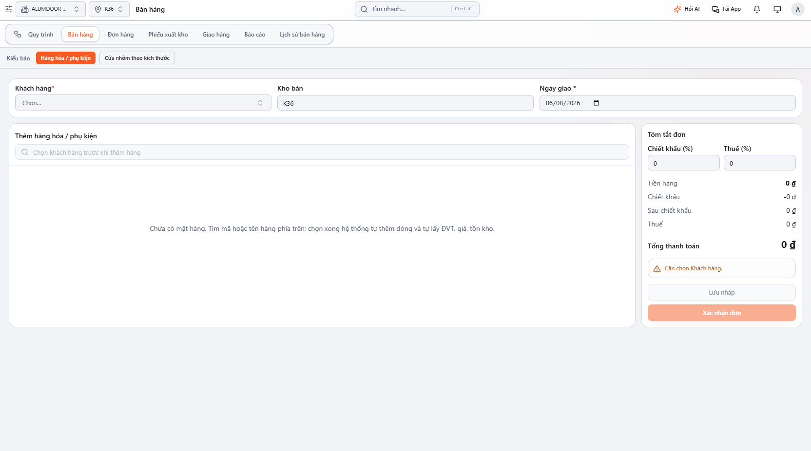
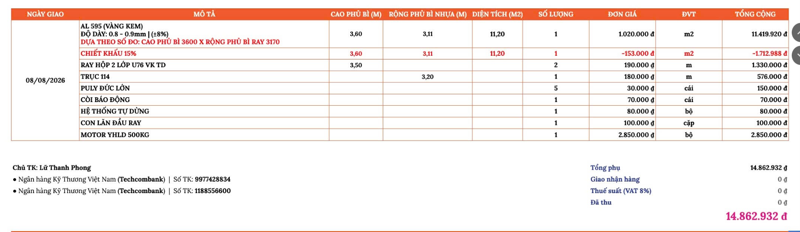

# Đơn đặt hàng — nguồn Word

- Nguồn: `C:/Users/Admin/Downloads/ĐƠN ĐẶT HÀNG.docx`
- Cập nhật nguồn: `2026-08-06T17:41:40+07:00`
- SHA-256: `94A0451A89AB036E2890D2BEC9BB37B07F051F33297422ACE280D59068D2DDEB`
- Sinh Markdown: `2026-08-11T21:27:47+07:00`

- Bổ sung tạo mới khách hàng hoặc NCC (Đại lý – Khách lẻ - NCC)
- Ngày đặt hàng, ngày giao hàng
- Bảng tính tiền xuất các nội dung như sau:
STT/SP/Chiều cao/Chiều rộng (nếu là cửa Đưc thì là chiều rộng sẽ tự nhảy ra là PB nhựa, nếu là cửa Úc thì nhảy ra là PB Ray...theo công thức Quy cách đã gửi trên google sheet)

Trường hợp ở chiều rộng nếu là đại lý thì tính theo công thức, còn nhận diện khách lẻ thì chiều rộng auto là Rộng pbray)/Diện tích/ Số lượng/Đơn giá/ĐVT/Tổng cộng

Nhận diện ray hộp thì nhập kích thước ở cột chiều cao (chiều cao x sl x đơn giá)

Nhận diện trục thì nhập kích thước ở cột chiều rộng (chiều rộng x sl x đơn giá)

## Hình/đối tượng nhúng

Tài liệu gốc có **2** hình/đối tượng nhúng:

### Hình 1

### Hình 2

