# Quy trình Alumdoor — nguồn Word

- Nguồn: `C:/Users/Admin/Downloads/25.7 QUY TRÌNH (1).docx`
- Cập nhật nguồn: `2026-08-11T20:30:29+07:00`
- SHA-256: `0397A208844ED5C8AD6AC75DE48693582AA9E0A40B2086A5F3FC24B9AC250228`
- Sinh Markdown: `2026-08-11T21:27:47+07:00`

QUY TRÌNH

Lưu ý dùm em: Em cần có 3 file chính như sau:

File 1 THEO DÕI CHUNG: trong file này thể hiện theo dõng đơn hàng – xuất hàng, nhập hàng, thu chi nội bộ, chi tiết sơn, Lịch sản xuất, Danh sách lỗi => tất cả kế toán dùng chung

File 2 TỒN KHO VẬT TƯ: Tồn nhôm (23 sheet), tồn lưới (2 sheet) => tất cả kế toán dùng chung

File 3 SỔ CHI TIẾT: Hàng ngày bấm chữ cập nhật thì mọi thông tin từ FILE 1 đổ về FILE 3 vào sổ chi tiết hàng ngày => sau đó tách riêng từng nội dung theo từng sheet trên sổ chi tiết => ở file này chỉ có kế toán tổng hợp, kế toán trưởng và Giám đốc phụ trách (tránh trường hợp cập nhật rồi, kế toán có tự ý thay đổi số liệu thì khi cập nhật lên sổ chi tiết rồi, chỉ có người phụ trách được sửa và thay đổi

Quy trình sơ bộ:

B1: Sales tạo đơn hàng => gửi đơn hàng

B2: Kế toán nhận đơn hàng => Cập nhật lên file Theo dõi đơn hàng – xuất hàng

B3: Từ sheet Theo dõi đơn hàng – xuất hàng (nguồn chính) phân bổ ra các sheet sau:

+ Sheet thu – chi nội bộ

+ Sheet nhập hàng:

+ Sheet Đơn hàng sản xuất được phân ra theo 4 loại [ĐỨC – ÚC – ĐÀI LOAN -  LƯỚI (có kết hợp lá Đài loan) – SIÊU TRƯỜNG] :

Dựa vào “nhóm sản phẩm” mà phân bổ ra sheet đơn hàng sản xuất (ĐH theo từng loại sẽ có cấu trúc đơn hàng khác nhau, xem chi tiết bên dưới)

Đơn hàng sản xuất được lưu theo ngày, Tên mỗi sheet là một khách hàng và là ĐH từng loại theo 1 số chứng từ

Trường hợp 1 số chứng từ mà 2 loại cửa khác nhau thì nhảy ra 2 sheet khác nhau theo đơn phân loại SX)

+ Sheet Chi tiết sơn: Nhận diện trong mỗi đơn hàng đơn hàng “ở ô màu sắc” có chữ “THÔ” thì tự động chuyển sang sheet chi tiết sơn

+ Sheet Lịch Sản xuất: Dựa vào “nhóm sản phẩm” mà phân bổ vào sheet lịch sản xuất

+ Sheet Danh sách lỗi: Kế toán nhập lỗi hoặc xuất đổi trả phải tìm số chứng từ đơn hàng từ ngày xuất hàng và lựa chọn nguyên nhân lỗi, các trường hợp lỗi sau:

Nguyên nhân 1: Lỗi motor – bình lưu điện (trong thời gian còn bảo hành 1 năm tính từ ngày giao hàng) mới được xuất đổi lỗi

Nguyên nhân 2: Lỗi do sản xuất (kế toán tự tính) => sau khi người làm lỗi chịu trách nhiệm kế toán tổng hợp xác nhận tình trạng xử lý

Nguyên nhân 3: Lỗi do nhà cung cấp, khi chọn chế độ gửi trả nhà cung cấp thì sẽ tự nhảy vào trừ công nợ của nhà cung cấp nếu chưa nhận được hàng đổi trả

Nguyên nhân 4: Lỗi do KH, tùy theo công đoạn sản xuất thì sẽ có chi phí khác nhau (kế toán tự tính)

+ B4: Từ sheet theo dõi đơn hàng – xuất hàng, theo ngày sẽ tự sinh ra phiếu xuất kho theo ngày (mỗi tháng là 1 folder, mỗi ngày là 1 file, trong file có từng phiếu xuất kho theo tên của khách hàng và theo từng số chứng)

+B5: Từ phiếu xuất kho sẽ cập nhật công nợ lên sổ chi tiết và trừ định mức vật tư

+ B6: Từ công nợ chi tiết, cập nhật công nợ khách hàng theo từng file khác nhau (mỗi khách hàng là 1 file)

+ Kết thúc

Từ đơn đặt hàng (tính tiền) => chuyển sang file “Theo dõi đơn hàng - xuất hàng”

Lưu ý:

Ở sheet này kế toán sẽ theo dõi được ngày mai giao các đơn hàng nào, có những đơn hàng hôm nay đặt mai giao, có những đơn hôm nay đặt mà 3-4 ngày sau mới giao. Nên kế toán phải tự điều chỉnh tay ở cột giao hàng để nắm lịch trình giao hàng và sắp xếp sản xuất

Ở file “Theo dõi đơn hàng - xuất hàng” sẽ có các nội dung chính cần hiển thị các cột như sau:

STT / NGÀY ĐẶT HÀNG/ NGÀY GIAO HÀNG / SỐ CHỨNG TỪ / ĐẠI LÝ / NGƯỜI PHỤ TRÁCH / NHÓM SẢN PHẨM / TÊN VẬT TƯ / GHI CHÚ (CỐ ĐỊNH THEO ĐƠN ĐẶT HÀNG/ CHI CHÚ TAY (TỰ ĐIỀN) / THU TIỀN BAO NHIÊU (NẾU CÓ) / LỆNH XUẤT KHO (THÔNG BÁO ĐÃ XUẤT HÀNG THÀNH CÔNG) / LỆNH SẢN XUẤT (THÔNG BÁO ĐÃ TẠO ĐƠN HÀNG SẢN XUẤT) / LỖI

Câu hỏi: Em muốn hiển thị thêm 1 cột lỗi vì khi nhập hàng lỗi về em muốn biết sản phẩm lỗi phát sinh từ số chứng từ nào để theo dõi lịch đổi bảo hành và gửi đổi nhà cung cấp. Hiện tại quy trình của bên em là khi có nhập hàng lỗi hoặc tiến hành đổi lỗi, kế toán sẽ tìm số chứng từ theo Khách hàng đã đặt và bấm chữ lỗi, thì thông tin đơn hàng lỗi sẽ nhảy sang sheet danh sách lỗi (trong file Theo dõi đơn hàng - xuất hàng) . Anh cho em đề xuất?

Từ file “Theo dõi đơn hàng - xuất hàng” nhận diện đơn hàng => đẩy sang sheet “Lịch sản xuất” và “đơn hàng sản xuất”

Ở sheet “Lịch sản xuất’ sẽ có các nội dung chính cần hiển thị các cột như sau:

NGÀY ĐẶT HÀNG / NGÀY GIAO HÀNG / NGÀY SẢN XUẤT / KHÁCH HÀNG / NHÓM SẢN PHẨM / TÊN SẢN PHẨM / CAO (THEO ĐƠN HÀNG KHÁCH ĐẶT) / RỘNG (THEO ĐƠN HÀNG KHÁCH ĐẶT) / DIỆN TÍCH / THỜI GIAN SẢN XUẤT / BỘ PHẬN PHỤ TRÁCH (ÚC - LƯỚI - ĐỨC - ĐÀI LOAN - SIÊU TRƯỜNG - LÒ SƠN) => nhận diện để phân bổ theo nhóm SP / LỊCH TĂNG CA / ĐỊNH MỨC CÔNG VIỆC (cố định)

Câu hỏi: Từ định mức thời gian hoàn thành cho 1 bộ cửa và số lượng đơn hàng theo nhóm Sản phẩm tính từ ngày đặt hàng. Em muốn hiển thị tổng thời gian sản xuất cho tất cả đơn hàng của một ngày (theo từng loại cửa) thời gian làm việc hành chính là 8 tiếng/ngày thì em sẽ biết được là cần cho thêm thời gian bao lâu để tăng ca ạ. Anh cho em đề xuất?

Ở sheet “đơn hàng sản xuất” sẽ có các nội dung chính cần hiển thị các ở các cột theo từng nhóm SP như sau:

ĐƠN HÀNG CỬA ĐỨC:

Thông tin KH – Số chứng từ - Ngày đặt hàng – Ngày giao hàng – khách đặt – ghi chú cố định từ Đơn đặt hàng hiển thị sang

Diễn giải theo từng bước như sau:

Bước 1: Xem từ đơn hàng “Tên vật tư/SP” , số đo chiều rộng khách đặt là gì => quy ra rộng cắt lá

Bước 2: Tính số lá ruột

Bước 3: Vào “File tồn nhôm” tìm “Tên vật tư/SP” (mỗi tên vật tư/SP là 1 sheet) => (tìm kiếm theo đối tượng Tên SP / kích thước gần nhất với rộng cắt lá / màu sắc)

File tồn nhôm hiện tại: https://docs.google.com/spreadsheets/d/1Dp0Ux8kfdrH0x1DaHlr_7HXnxi83TztLMnE5H91c-aU/edit?gid=814818755#gid=814818755

Bước 4: Sau khi tìm được đối tượng vật tư cần lấy => Quay lại đơn hàng sản xuất và điền vào hình bên dưới

Bước 5: Trừ tồn nhôm

Nhập tên KH, số chứng từ, tích vào đối tượng vật tư mình đã chọn để sản xuất (có thể chọn nhiều khẩu độ khác nhau, số lá và số lần cắt) => bấm vào cắt nhôm => tự động trừ và nhập lại phần dư, cập nhật ngày nhập lại)

+ Trường hợp chưa đóng gói thành phẩm: muốn thu hồi đối tượng vật tư vừa chọn để sản xuất thì nhập số chứng từ => chọn tìm thông tin cần hoàn => chọn hoàn cắt

+ Trường hợp đã đóng gói thành phẩm: muốn thu hồi đối tượng vật tư vừa chọn để sản xuất thì nhập số chứng từ => chọn tìm thông tin cần hoàn => trả hàng

Bước 6: Sau khi chọn đối tượng vật tư mình sản xuất có cột màu sắc là “THÔ” thì sẽ tự nhảy sang sheet lịch sơn

+ Đối với cửa Đức: các nội dung chính cần hiển thị theo hình

| Khách hàng | B | Ngày đặt | D | E | F |
| --- | --- | --- | --- | --- | --- |
| Số chứng từ |  | Ngày giao |  |  |  |
| Khách đặt | Bộ 1: (hiển thị Tên SP/Vật Tư x kích thước x Màu sắc x hệ thống tự dừng (nếu có) x số lượng) Ví dụ: AL548 Cpb 3m x Rpb nhựa 4m Ghi sần Hệ thống tự dừng x 1 bộ | Bộ 1: (hiển thị Tên SP/Vật Tư x kích thước x Màu sắc x hệ thống tự dừng (nếu có) x số lượng) Ví dụ: AL548 Cpb 3m x Rpb nhựa 4m Ghi sần Hệ thống tự dừng x 1 bộ | Bộ 1: (hiển thị Tên SP/Vật Tư x kích thước x Màu sắc x hệ thống tự dừng (nếu có) x số lượng) Ví dụ: AL548 Cpb 3m x Rpb nhựa 4m Ghi sần Hệ thống tự dừng x 1 bộ | Bộ 1: (hiển thị Tên SP/Vật Tư x kích thước x Màu sắc x hệ thống tự dừng (nếu có) x số lượng) Ví dụ: AL548 Cpb 3m x Rpb nhựa 4m Ghi sần Hệ thống tự dừng x 1 bộ | Bộ 1: (hiển thị Tên SP/Vật Tư x kích thước x Màu sắc x hệ thống tự dừng (nếu có) x số lượng) Ví dụ: AL548 Cpb 3m x Rpb nhựa 4m Ghi sần Hệ thống tự dừng x 1 bộ |
| Khách đặt | Bộ 2: | Bộ 2: | Bộ 2: | Bộ 2: | Bộ 2: |
| Khách đặt | Bộ 3: …. (nhảy tự động theo đơn hàng khách đặt, nếu khách đặt 10 bộ thì nhảy 10 dòng) | Bộ 3: …. (nhảy tự động theo đơn hàng khách đặt, nếu khách đặt 10 bộ thì nhảy 10 dòng) | Bộ 3: …. (nhảy tự động theo đơn hàng khách đặt, nếu khách đặt 10 bộ thì nhảy 10 dòng) | Bộ 3: …. (nhảy tự động theo đơn hàng khách đặt, nếu khách đặt 10 bộ thì nhảy 10 dòng) | Bộ 3: …. (nhảy tự động theo đơn hàng khách đặt, nếu khách đặt 10 bộ thì nhảy 10 dòng) |
| RAY | RAY HỘP TD U76 / RAY ĐƠN TD U76 / RAY HỘP U100 (NHÓM RAY) hiển thị chiều cao x số lượng x màu sắc | RAY HỘP TD U76 / RAY ĐƠN TD U76 / RAY HỘP U100 (NHÓM RAY) hiển thị chiều cao x số lượng x màu sắc | RAY HỘP TD U76 / RAY ĐƠN TD U76 / RAY HỘP U100 (NHÓM RAY) hiển thị chiều cao x số lượng x màu sắc | RAY HỘP TD U76 / RAY ĐƠN TD U76 / RAY HỘP U100 (NHÓM RAY) hiển thị chiều cao x số lượng x màu sắc | RAY HỘP TD U76 / RAY ĐƠN TD U76 / RAY HỘP U100 (NHÓM RAY) hiển thị chiều cao x số lượng x màu sắc |
| CẮT RAY | Bấm chọn “khẩu độ” từ file tồn nhôm để chọn kích thước phù hợp | Bấm chọn “khẩu độ” từ file tồn nhôm để chọn kích thước phù hợp | Bấm chọn “khẩu độ” từ file tồn nhôm để chọn kích thước phù hợp | Bấm chọn “khẩu độ” từ file tồn nhôm để chọn kích thước phù hợp | Bấm chọn “khẩu độ” từ file tồn nhôm để chọn kích thước phù hợp |
| Ghi chú 01 (cố định) | Từ ghi chú trong file đơn đặt hàng nhảy qua | Từ ghi chú trong file đơn đặt hàng nhảy qua | Từ ghi chú trong file đơn đặt hàng nhảy qua | Từ ghi chú trong file đơn đặt hàng nhảy qua | Từ ghi chú trong file đơn đặt hàng nhảy qua |
| Ghi chú 02 | Kế toán điền tay | Kế toán điền tay | Kế toán điền tay | Kế toán điền tay | Kế toán điền tay |
| Đóng gói | Kế toán điền tay | Kế toán điền tay | Kế toán điền tay | Kế toán điền tay | Kế toán điền tay |
| Chạy chữ: | Kế toán điền tay | Kế toán điền tay | Kế toán điền tay | Kế toán điền tay | Kế toán điền tay |
|  | Tên vật tư/SP | Số lá | Chiều rộng cắt lá | Hệ thông tự dừng | Số KG |
| BỘ 1 | AL548 | .... LÁ RUỘT + 1 LÁ ĐẦU + 3 LÁ ĐÁY (hiển thị cố định, kế toán điền tay số lá ruột) (trong đó số lá ruột được tính theo công thức theo từng SP (theo bản lá bên dưới) Câu hỏi: Trường hợp khách chỉ đặt lá ruột hoặc lá đầu hoặc bộ 3 lá đáy (một trong các loại lá yếm, lá trung gian, lá đáy lớn) thì kế toán sẽ điều chỉnh thế nào anh? Bấm chọn “khẩu độ” từ file tồn nhôm để chọn kích thước phù hợp (kích thước nhôm chọn để cắt không được nhỏ hơn chiều rộng cắt lá) | + Khách đại lý (nhận diện):  Công thức = kích thước pb nhựa - 0,02 + Khách lẻ (nhận diện):  Công thức = kích thước pb ray - 0,06 | CÓ HOẶC KHÔNG | ĐIỀN TAY |
| SẢN XUẤT BỘ 1 | LẤY KHỔ  (cố định) | Ví dụ:  Lá ruột 4100 x 30 LÁ THÔ, 3920 X 22 Ghi sần  Lá đầu: 4150 x 1 lá THÔ Lá yếm: 3900 x 1 lá THÔ Lá trung gian: 3950 x 1 LÁ THÔ Lá đáy lớn: 3985 x 1 LÁ THÔ  Phát hiện là thô thì nhảy sang sheet theo dõi sơn, nếu lá màu thì không cần |  |  |  |
| BỘ 2 |  |  |  |  |  |
| BỘ 3 | Tùy theo số bộ khách đặt ở trên thì nhảy ra theo bao nhiêu dòng | Tùy theo số bộ khách đặt ở trên thì nhảy ra theo bao nhiêu dòng | Tùy theo số bộ khách đặt ở trên thì nhảy ra theo bao nhiêu dòng | Tùy theo số bộ khách đặt ở trên thì nhảy ra theo bao nhiêu dòng | Tùy theo số bộ khách đặt ở trên thì nhảy ra theo bao nhiêu dòng |

Ví dụ: theo như đơn hàng Bộ 1 khách đặt ở trên

“AL548 Cpb 3m x Rpb nhựa 4m Ghi sần Hệ thống tự dừng x 1 bộ”

thì mình có công thức tính số lá ruột như sau:

Công thức: ((Cao PB – 130) : bản lá theo “mã Tên vật tư/SP” ) – 1)

= ((3-0.13)/0.055)-1) = 52.18 – 1 = 51 lá

Làm tròn số phẩy lớn hơn 0.6

(ví dụ: 52.6 thì là 52, nếu <52.6 thì là 51)

Thì: 51 LÁ RUỘT + 1 LÁ ĐẦU + 3 LÁ ĐÁY

File tồn nhôm hiện tại: (có 23 sheet, mỗi sheet 1 mã Tên Vật tư/tên SP)

ĐƠN HÀNG CỬA ÚC:

Diễn giải theo từng bước như sau:

Thông tin KH – Số chứng từ - Ngày đặt hàng – Ngày giao hàng – khách đặt – ghi chú cố định từ Đơn đặt hàng hiển thị sang

B1: Ở cột số (2) tự hiển thị theo đơn hàng khách đặt (Cửa motor ngoài Hoặc cửa kéo tay Hoặc cửa motor trong)

B2: Ở cột số (3) tự hiển thị độ dày khách đặt (4D, 4.3D – 4.7D, 4.8D – 5.2D, 6D)

B3: Ở cột số (4) điền tay theo lô khách yêu cầu

B4: Ở cột số (5) số lá có công thức như sau:

Cửa motor trong và kéo tay: (Chiêu cao PB : 0.465) + 2

Trường hợp 1: Sau dấu phẩy chữ số thứ nhất: Hàng phần mười (ví dụ: 0,0) => làm tròn là 0

Ví dụ: Cao pb (2m8:0.465)+2 = 8.0 => thì số lá sẽ là “8”

Trường hợp 2: Sau dấu phẩy chữ số thứ nhất: Hàng phần mười (ví dụ: 0,1 đến 0,3) => làm tròn là 0.3

Ví dụ: Cao pb (2m9:0.465)+2 = 8.2 => thì số lá sẽ là “8.3”

Trường hợp 3: Sau dấu phẩy chữ số thứ nhất: Hàng phần mười (ví dụ: 0,4 đến 0,7) => làm tròn là 0.7

Ví dụ: Cao pb (3m:0.465)+2 = 8.4 => thì số lá sẽ là “8.7”

Trường hợp 4: Sau dấu phẩy chữ số thứ nhất: Hàng phần mười (ví dụ: 0,8 đến > 0,9) => làm tròn là 1

Ví dụ: Cao pb (3m2:0.465)+2 = 8.8 => thì số lá sẽ là “9”

Cửa motor ngoài (không tự dừng): (Chiêu cao PB : 0.465) + 1.5

Trường hợp 1: Sau dấu phẩy chữ số thứ nhất: Hàng phần mười (ví dụ: 0,0) => làm tròn là 0

Ví dụ: Cao pb (2m6:0.465)+1.5 = 7.0 => thì số lá sẽ là “7”

Trường hợp 2: Sau dấu phẩy chữ số thứ nhất: Hàng phần mười (ví dụ: 0,1 đến 0,3) => làm tròn là 0.3

Ví dụ: Cao pb (2m7:0.465)+1.5 = 7.3 => thì số lá sẽ là “7.3”

Trường hợp 3: Sau dấu phẩy chữ số thứ nhất: Hàng phần mười (ví dụ: 0,4 đến 0,7) => làm tròn là 0.7

Ví dụ: Cao pb (2m8:0.465)+1.5 = 7.5 => thì số lá sẽ là “7.7”

Trường hợp 4: Sau dấu phẩy chữ số thứ nhất: Hàng phần mười (ví dụ: 0,8 đến > 0,9) => làm tròn là 1

Ví dụ: Cao pb (3m:0.465)+1.5 = 7.9 => thì số lá sẽ là “8”

Cửa motor ngoài (có hệ thống tự dừng): (Chiều cao PB : 0.465) + 1.3

Trường hợp 1: Sau dấu phẩy chữ số thứ nhất: Hàng phần mười (ví dụ: 0,0) => làm tròn là 0

Ví dụ: Cao pb (3m15:0.465)+1.3 = 8.0 => thì số lá sẽ là “8”

Trường hợp 2: Sau dấu phẩy chữ số thứ nhất: Hàng phần mười (ví dụ: 0,1 đến 0,3) => làm tròn là 0.3

Ví dụ: Cao pb (3m2:0.465)+1.3 = 8.1  => thì số lá sẽ là “8.3”

Trường hợp 3: Sau dấu phẩy chữ số thứ nhất: Hàng phần mười (ví dụ: 0,4 đến 0,7) => làm tròn là 0.7

Ví dụ: Cao pb (3m4:0.465)+1.3 = 8.6 => thì số lá sẽ là “8.7”

Trường hợp 4: Sau dấu phẩy chữ số thứ nhất: Hàng phần mười (ví dụ: 0,8 đến > 0,9) => làm tròn là 1

Ví dụ: Cao pb (3m5:0.465)+1.3 = 8.8  => thì số lá sẽ là “9”

B4: Cột (6) Từ số đo phủ bì ray => quy ra rộng cắt lá

Công thức: Rộng pbray – 0.03

B5: Số lượng (7) hiển thị theo đơn đặt hàng

B6: Màu sắc (8) hiển thị theo đơn hàng khách đặt

Trường hợp tôn mạ màu (nhận diện bằng các cặp màu như: XN-VK, Café – XR, Trắng – Xám, Ghi úc – kem úc)

Trường hợp sơn tỉnh điện (STĐ) thì sẽ là tôn kẽm => nhảy sang sheet chi tiết sơn

B7: Cột lò xo (9) (tự điền tay)

B8: Cột Puly (10) (tự điền tay)

B9: Khóa ngang (11) nếu đơn đặt hàng có lấy khóa ngang => sẽ tự cập nhật

B10: Tự dừng (12) nếu như cửa úc Motor ngoài đơn đặt hàng yêu cầu có đặt kèm hệ thống tự dừng => thì cột số (13) sẽ hiện đối tượng vật tư lấy cắt từ file tồn nhôm (nếu là nhôm thô thì cập nhật vào sheet chi tiết sơn)

| Khách hàng | B | C | D | E | F | G | Ngày đặt hàng | Ngày đặt hàng (2) | Ngày đặt hàng (3) | K | L | M | N | O | P |
| --- | --- | --- | --- | --- | --- | --- | --- | --- | --- | --- | --- | --- | --- | --- | --- |
| Số chứng từ |  |  |  |  |  |  | Ngày giao hàng | Ngày giao hàng | Ngày giao hàng |  |  |  |  |  |  |
| Khách đặt | Bộ 1: (hiển thị Tên SP/Vật Tư x kích thước x Màu sắc x hệ thống tự dừng (nếu có) x số lượng) Ví dụ: Cửa motor ngoài 4.6D, lô trong Cpb 3m x Rpbray 4m XN – VK, hệ thống tự dừng x 1 bộ | Bộ 1: (hiển thị Tên SP/Vật Tư x kích thước x Màu sắc x hệ thống tự dừng (nếu có) x số lượng) Ví dụ: Cửa motor ngoài 4.6D, lô trong Cpb 3m x Rpbray 4m XN – VK, hệ thống tự dừng x 1 bộ | Bộ 1: (hiển thị Tên SP/Vật Tư x kích thước x Màu sắc x hệ thống tự dừng (nếu có) x số lượng) Ví dụ: Cửa motor ngoài 4.6D, lô trong Cpb 3m x Rpbray 4m XN – VK, hệ thống tự dừng x 1 bộ | Bộ 1: (hiển thị Tên SP/Vật Tư x kích thước x Màu sắc x hệ thống tự dừng (nếu có) x số lượng) Ví dụ: Cửa motor ngoài 4.6D, lô trong Cpb 3m x Rpbray 4m XN – VK, hệ thống tự dừng x 1 bộ | Bộ 1: (hiển thị Tên SP/Vật Tư x kích thước x Màu sắc x hệ thống tự dừng (nếu có) x số lượng) Ví dụ: Cửa motor ngoài 4.6D, lô trong Cpb 3m x Rpbray 4m XN – VK, hệ thống tự dừng x 1 bộ | Bộ 1: (hiển thị Tên SP/Vật Tư x kích thước x Màu sắc x hệ thống tự dừng (nếu có) x số lượng) Ví dụ: Cửa motor ngoài 4.6D, lô trong Cpb 3m x Rpbray 4m XN – VK, hệ thống tự dừng x 1 bộ | Bộ 1: (hiển thị Tên SP/Vật Tư x kích thước x Màu sắc x hệ thống tự dừng (nếu có) x số lượng) Ví dụ: Cửa motor ngoài 4.6D, lô trong Cpb 3m x Rpbray 4m XN – VK, hệ thống tự dừng x 1 bộ | Bộ 1: (hiển thị Tên SP/Vật Tư x kích thước x Màu sắc x hệ thống tự dừng (nếu có) x số lượng) Ví dụ: Cửa motor ngoài 4.6D, lô trong Cpb 3m x Rpbray 4m XN – VK, hệ thống tự dừng x 1 bộ | Bộ 1: (hiển thị Tên SP/Vật Tư x kích thước x Màu sắc x hệ thống tự dừng (nếu có) x số lượng) Ví dụ: Cửa motor ngoài 4.6D, lô trong Cpb 3m x Rpbray 4m XN – VK, hệ thống tự dừng x 1 bộ | Bộ 1: (hiển thị Tên SP/Vật Tư x kích thước x Màu sắc x hệ thống tự dừng (nếu có) x số lượng) Ví dụ: Cửa motor ngoài 4.6D, lô trong Cpb 3m x Rpbray 4m XN – VK, hệ thống tự dừng x 1 bộ | Bộ 1: (hiển thị Tên SP/Vật Tư x kích thước x Màu sắc x hệ thống tự dừng (nếu có) x số lượng) Ví dụ: Cửa motor ngoài 4.6D, lô trong Cpb 3m x Rpbray 4m XN – VK, hệ thống tự dừng x 1 bộ | Bộ 1: (hiển thị Tên SP/Vật Tư x kích thước x Màu sắc x hệ thống tự dừng (nếu có) x số lượng) Ví dụ: Cửa motor ngoài 4.6D, lô trong Cpb 3m x Rpbray 4m XN – VK, hệ thống tự dừng x 1 bộ | Bộ 1: (hiển thị Tên SP/Vật Tư x kích thước x Màu sắc x hệ thống tự dừng (nếu có) x số lượng) Ví dụ: Cửa motor ngoài 4.6D, lô trong Cpb 3m x Rpbray 4m XN – VK, hệ thống tự dừng x 1 bộ | Bộ 1: (hiển thị Tên SP/Vật Tư x kích thước x Màu sắc x hệ thống tự dừng (nếu có) x số lượng) Ví dụ: Cửa motor ngoài 4.6D, lô trong Cpb 3m x Rpbray 4m XN – VK, hệ thống tự dừng x 1 bộ | Bộ 1: (hiển thị Tên SP/Vật Tư x kích thước x Màu sắc x hệ thống tự dừng (nếu có) x số lượng) Ví dụ: Cửa motor ngoài 4.6D, lô trong Cpb 3m x Rpbray 4m XN – VK, hệ thống tự dừng x 1 bộ |
| Khách đặt | Bộ 2: | Bộ 2: | Bộ 2: | Bộ 2: | Bộ 2: | Bộ 2: | Bộ 2: | Bộ 2: | Bộ 2: | Bộ 2: | Bộ 2: | Bộ 2: | Bộ 2: | Bộ 2: | Bộ 2: |
| Khách đặt | Bộ 3: …. (nhảy tự động theo đơn hàng khách đặt, nếu khách đặt 10 bộ thì nhảy 10 dòng) | Bộ 3: …. (nhảy tự động theo đơn hàng khách đặt, nếu khách đặt 10 bộ thì nhảy 10 dòng) | Bộ 3: …. (nhảy tự động theo đơn hàng khách đặt, nếu khách đặt 10 bộ thì nhảy 10 dòng) | Bộ 3: …. (nhảy tự động theo đơn hàng khách đặt, nếu khách đặt 10 bộ thì nhảy 10 dòng) | Bộ 3: …. (nhảy tự động theo đơn hàng khách đặt, nếu khách đặt 10 bộ thì nhảy 10 dòng) | Bộ 3: …. (nhảy tự động theo đơn hàng khách đặt, nếu khách đặt 10 bộ thì nhảy 10 dòng) | Bộ 3: …. (nhảy tự động theo đơn hàng khách đặt, nếu khách đặt 10 bộ thì nhảy 10 dòng) | Bộ 3: …. (nhảy tự động theo đơn hàng khách đặt, nếu khách đặt 10 bộ thì nhảy 10 dòng) | Bộ 3: …. (nhảy tự động theo đơn hàng khách đặt, nếu khách đặt 10 bộ thì nhảy 10 dòng) | Bộ 3: …. (nhảy tự động theo đơn hàng khách đặt, nếu khách đặt 10 bộ thì nhảy 10 dòng) | Bộ 3: …. (nhảy tự động theo đơn hàng khách đặt, nếu khách đặt 10 bộ thì nhảy 10 dòng) | Bộ 3: …. (nhảy tự động theo đơn hàng khách đặt, nếu khách đặt 10 bộ thì nhảy 10 dòng) | Bộ 3: …. (nhảy tự động theo đơn hàng khách đặt, nếu khách đặt 10 bộ thì nhảy 10 dòng) | Bộ 3: …. (nhảy tự động theo đơn hàng khách đặt, nếu khách đặt 10 bộ thì nhảy 10 dòng) | Bộ 3: …. (nhảy tự động theo đơn hàng khách đặt, nếu khách đặt 10 bộ thì nhảy 10 dòng) |
| Ghi chú 01 (cố định) | Từ ghi chú trong file đơn đặt hàng nhảy qua | Từ ghi chú trong file đơn đặt hàng nhảy qua | Từ ghi chú trong file đơn đặt hàng nhảy qua | Từ ghi chú trong file đơn đặt hàng nhảy qua | Từ ghi chú trong file đơn đặt hàng nhảy qua | Từ ghi chú trong file đơn đặt hàng nhảy qua | Từ ghi chú trong file đơn đặt hàng nhảy qua | Từ ghi chú trong file đơn đặt hàng nhảy qua | Từ ghi chú trong file đơn đặt hàng nhảy qua | Từ ghi chú trong file đơn đặt hàng nhảy qua | Từ ghi chú trong file đơn đặt hàng nhảy qua | Từ ghi chú trong file đơn đặt hàng nhảy qua | Từ ghi chú trong file đơn đặt hàng nhảy qua | Từ ghi chú trong file đơn đặt hàng nhảy qua | Từ ghi chú trong file đơn đặt hàng nhảy qua |
| Ghi chú 02 | Kế toán điền tay | Kế toán điền tay | Kế toán điền tay | Kế toán điền tay | Kế toán điền tay | Kế toán điền tay | Kế toán điền tay | Kế toán điền tay | Kế toán điền tay | Kế toán điền tay | Kế toán điền tay | Kế toán điền tay | Kế toán điền tay | Kế toán điền tay | Kế toán điền tay |
| Chạy chữ: | Kế toán điền tay | Kế toán điền tay | Kế toán điền tay | Kế toán điền tay | Kế toán điền tay | Kế toán điền tay | Kế toán điền tay | Kế toán điền tay | Kế toán điền tay | Kế toán điền tay | Kế toán điền tay | Kế toán điền tay | Kế toán điền tay | Kế toán điền tay | Kế toán điền tay |
| STT (1) | Tên SP /Vật tư (2) | Độ dày tôn (3) | Lô cuốn (4) | Số lá (5) | Rộng cắt lá (6) | SL  (7) | SL  (7) | Màu sắc Khách đặt (8) | Lò xo  (Cái) (9) | Lò xo  (Cái) (9) | Puly (Cái) (10) | Khóa ngang (11) | Hệ thống tự dừng (12) | Bộ 3 lá đáy (13) |  |
| Bộ 1 | Cửa motor ngoài  Hoặc cửa kéo tay Hoặc cửa motor trong |  | Trong hoặc ngoài |  | Công thức: Rpbray – 0.03 | 1 | 1 | XN- VK Hoặc  Sơn tĩnh điện |  |  |  |  |  |  |  |
| Bộ 2 |  |  |  |  |  |  |  |  |  |  |  |  |  |  |  |

ĐƠN HÀNG CỬA ĐỨC KÉO TAY (NHÓM SP CỬA TẤM LIỀN ÚC):

Áp dụng cho

Diễn giải theo từng bước như sau:

B1: Thông tin KH – Số chứng từ - Ngày đặt hàng – Ngày giao hàng – khách đặt – ghi chú cố định từ Đơn đặt hàng hiển thị sang

B2: Ở dòng khóa ngang (2): nếu trong đơn hàng có phát sinh khóa ngang thì dòng AL70 (1 lớp) sẽ hiện là “1 lá”

Nếu ở dòng “Ghi chú cố đinh” thể hiện dập khe thoáng bao nhiêu hàng thì sẽ là bấy nhiêu lá AL70 (1 lớp)

LƯU Ý: LÁ SỬ DỤNG LẮP KHÓA NGANG VÀ DẬP KHE THOÁNG LÀ LÁ AL70 (1 lớp)

VD:

Tại sao biết 3 hàng lỗ thoáng thì chiều cao AL70 (1 lớp) là 0.204?

Trả lời: ví dụ 3 hàng lỗ thoáng = 3 lá x bản lá 0.068 [AL70 (1 lớp)] (nếu 4 hàng thì là 4 lá x bản lá)

B3: Ray (đơn đặt hàng khách chọn thêm ray sắt hoặc ray đơn U76 hoặc ray hộp U76)

B4: ở dòng cắt ray, nếu khách chọn ray đơn U76 hoặc ray hộp U76 thì tìm đối tượng vật tư lấy cắt từ file tồn nhôm (nếu là nhôm thô thì cập nhật vào sheet chi tiết sơn)

B5: Ở cột (5) Tên Vật tư/SP luôn thể hiện 1 bộ bao gồm 2 dòng là AL70 (1 lớp) và AL70 (2 lớp) => cố định không thay đổi)

B6: Ở cột (6) Số lá nhôm:

Áp dụng công thức: (Chiều cao pb – 0.13):0.068

Ví dụ: Cao pb 3m = (3-0.13)/0.068 = 42 lá

+ Trường hợp 1: Nếu khách đặt là AL70 (2 lớp) thì ở dòng song song với AL70 (2 lớp) thể hiện số 42

+ Trường hợp 2: Nếu khách đặt là AL70 (1 lớp) thì ở dòng song song với AL70 (2 lớp) thể hiện số 1, đồng thời thì ở dòng song song với AL70 (1 lớp) là 41

+ Trường hợp 3: Nếu khách đặt là AL70 (2 lớp) có khóa ngang và có 3 hàng lỗ thoáng thì sẽ có 4 lá 1 lớp (trong đó có 3 lá dập khe thoáng và 1 lá sử dụng làm khóa ngang). Lúc này ở dòng song song với AL70 (2 lớp) thể hiện số 38, đồng thời thì ở dòng song song với AL70 (1 lớp) là 4

B7: Ở cột Bộ 3 lá đáy (13) số lượng bộ thể hiện bao nhiêu bộ thì cắt bao nhiêu bộ 3 lá đáy tìm đối tượng vật tư lấy cắt từ file tồn nhôm (nếu là nhôm thô thì cập nhật vào sheet chi tiết sơn)

B8: Ở cột Chiều rộng cắt lá (8), có 2 trường hợp:

+ Trường hợp 1: Đơn hàng nhận diện khách đặt thêm ray sắt U70 (không ron) thì

Công thức rộng cắt lá = Rộng pb ray – 0.05

+ Trường hợp 2: Đơn hàng nhận diện khách đặt thêm ray hộp U76 hoặc ray đơn U76 thì

Công thức rộng cắt lá = Rộng pb ray – 0.08

B9: Lô cuốn + Puly + lò xo + số kg tự điền tay

ĐƠN HÀNG CỬA ĐÀI LOAN:

Diễn giải theo từng bước như sau:

Thông tin KH – Số chứng từ - Ngày đặt hàng – Ngày giao hàng – khách đặt – ghi chú cố định từ Đơn đặt hàng hiển thị sang

| Khách hàng | B | C | D | E | Ngày giao hàng | Ngày giao hàng (2) | H | I | J |
| --- | --- | --- | --- | --- | --- | --- | --- | --- | --- |
| Số chứng từ |  |  |  |  | Ngày xuất hàng | Ngày xuất hàng |  |  |  |
| Khách hàng | Bộ 1: Từ đơn hàng nhảy sang Ví dụ: Lá Đài Loan 6D Cpb 3m x Rpbray 4m XN-VK (màu nào trước thì từ sẽ nằm trước), V4 3970 x 2 cây, ray sắt có ron 2m9 x 2 cây | Bộ 1: Từ đơn hàng nhảy sang Ví dụ: Lá Đài Loan 6D Cpb 3m x Rpbray 4m XN-VK (màu nào trước thì từ sẽ nằm trước), V4 3970 x 2 cây, ray sắt có ron 2m9 x 2 cây | Bộ 1: Từ đơn hàng nhảy sang Ví dụ: Lá Đài Loan 6D Cpb 3m x Rpbray 4m XN-VK (màu nào trước thì từ sẽ nằm trước), V4 3970 x 2 cây, ray sắt có ron 2m9 x 2 cây | Bộ 1: Từ đơn hàng nhảy sang Ví dụ: Lá Đài Loan 6D Cpb 3m x Rpbray 4m XN-VK (màu nào trước thì từ sẽ nằm trước), V4 3970 x 2 cây, ray sắt có ron 2m9 x 2 cây | Bộ 1: Từ đơn hàng nhảy sang Ví dụ: Lá Đài Loan 6D Cpb 3m x Rpbray 4m XN-VK (màu nào trước thì từ sẽ nằm trước), V4 3970 x 2 cây, ray sắt có ron 2m9 x 2 cây | Bộ 1: Từ đơn hàng nhảy sang Ví dụ: Lá Đài Loan 6D Cpb 3m x Rpbray 4m XN-VK (màu nào trước thì từ sẽ nằm trước), V4 3970 x 2 cây, ray sắt có ron 2m9 x 2 cây | Bộ 1: Từ đơn hàng nhảy sang Ví dụ: Lá Đài Loan 6D Cpb 3m x Rpbray 4m XN-VK (màu nào trước thì từ sẽ nằm trước), V4 3970 x 2 cây, ray sắt có ron 2m9 x 2 cây | Bộ 1: Từ đơn hàng nhảy sang Ví dụ: Lá Đài Loan 6D Cpb 3m x Rpbray 4m XN-VK (màu nào trước thì từ sẽ nằm trước), V4 3970 x 2 cây, ray sắt có ron 2m9 x 2 cây | Bộ 1: Từ đơn hàng nhảy sang Ví dụ: Lá Đài Loan 6D Cpb 3m x Rpbray 4m XN-VK (màu nào trước thì từ sẽ nằm trước), V4 3970 x 2 cây, ray sắt có ron 2m9 x 2 cây |
| Khách hàng | Bộ 2: | Bộ 2: | Bộ 2: | Bộ 2: | Bộ 2: | Bộ 2: | Bộ 2: | Bộ 2: | Bộ 2: |
| Khách hàng | Bộ 3: | Bộ 3: | Bộ 3: | Bộ 3: | Bộ 3: | Bộ 3: | Bộ 3: | Bộ 3: | Bộ 3: |
| Ghi chú 01  (cố định) | Từ ghi chú trong file đơn đặt hàng nhảy qua | Từ ghi chú trong file đơn đặt hàng nhảy qua | Từ ghi chú trong file đơn đặt hàng nhảy qua | Từ ghi chú trong file đơn đặt hàng nhảy qua | Từ ghi chú trong file đơn đặt hàng nhảy qua | Từ ghi chú trong file đơn đặt hàng nhảy qua | Từ ghi chú trong file đơn đặt hàng nhảy qua | Từ ghi chú trong file đơn đặt hàng nhảy qua | Từ ghi chú trong file đơn đặt hàng nhảy qua |
| Ghi chú 02 | kế toán điền tay | kế toán điền tay | kế toán điền tay | kế toán điền tay | kế toán điền tay | kế toán điền tay | kế toán điền tay | kế toán điền tay | kế toán điền tay |
| Chạy chữ | kế toán điền tay | kế toán điền tay | kế toán điền tay | kế toán điền tay | kế toán điền tay | kế toán điền tay | kế toán điền tay | kế toán điền tay | kế toán điền tay |
| STT  (1) | Tên SP/Vật tư  (2) | Độ dày tôn sản xuất (3) | Số lá  (4) | Rộng cắt lá  (5) | SL  (6) | Màu sắc  (7) | V  (8) | Ray sắt có ron (9) | Lắc phụ 33 - 3 lỗ  (cái) (10) |
|  |  |  | Số lá ruột + 1 lá đáy |  |  |  |  |  |  |

Diễn giải:

+ Cột số 1: Số thứ tự

+ Cột số 2: Điền thông tin Tên SP/Vật tư cửa khách đặt là Cửa Đài loan hoặc Cửa Đài loan kéo tay

+ Cột số 3: Độ dày tole sản xuất (Tên vật tư là tôn 6D thì tôn sản xuất là 5.2D, 7D thì tôn sản xuất là 5.2D…theo định mức)

+ Cột số 4: Số lá Cao pb x 13

Trường hợp : Sau dấu phẩy chữ số thứ nhất: Hàng phần mười (ví dụ: >0,8) => làm tròn là 1

Ví dụ: Cao pb 2m97 (2m97x13)= 37.96 => thì số lá sẽ là “37 lá ruột + 1 lá đáy”

Ví dụ: Cao pb 2m97 (2m9x13)= 37.7 => thì số lá sẽ là “36 lá ruột + 1 lá đáy”

Anh cho em hỏi nếu như chỉ có lá ruột thôi thì sao?

Câu hỏi?

Nếu như đặt hàng khách chỉ lấy lá ruột thôi thì đặt hàng làm sao để “đơn hàng sản xuất” hiểu rằng chỉ lấy lá hoặc phụ kiện chứ không lấy hoàn thiện để đưa ra đơn sản xuất?

## Hình/đối tượng nhúng

Tài liệu gốc có **17** hình/đối tượng nhúng:

### Hình 1

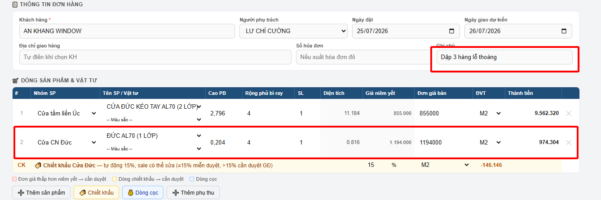

### Hình 2

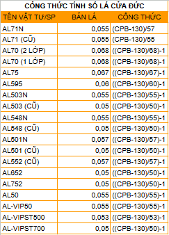

### Hình 3

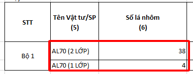

### Hình 4

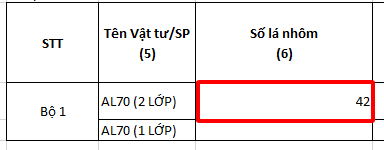

### Hình 5

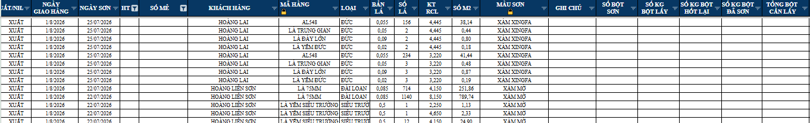

### Hình 6

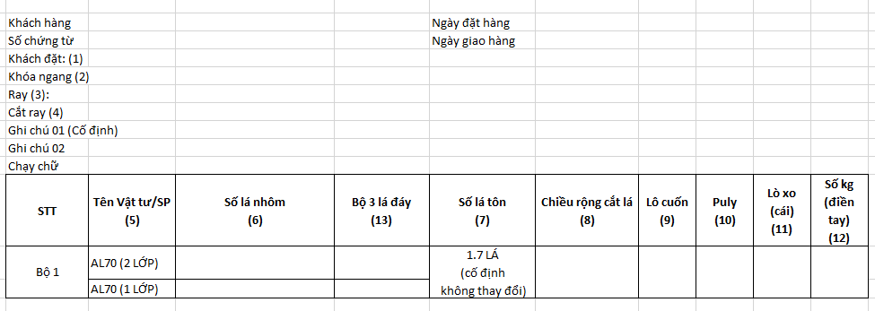

### Hình 7

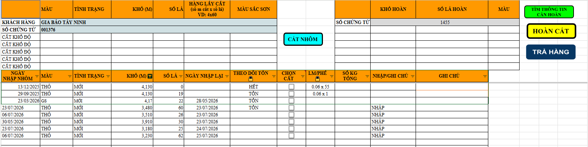

### Hình 8

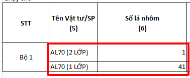

### Hình 9

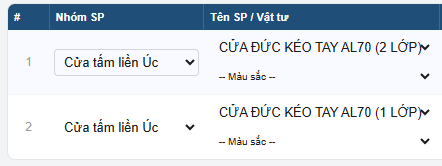

### Hình 10

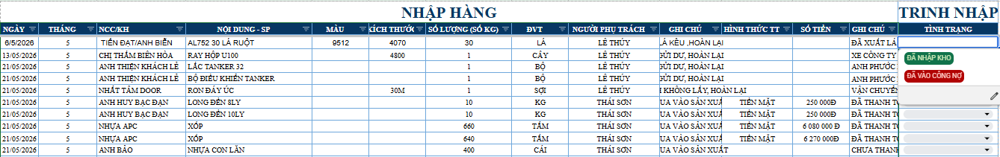

### Hình 11

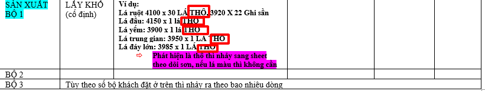

### Hình 12

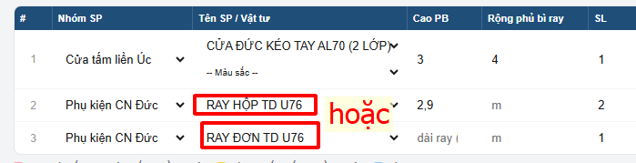

### Hình 13

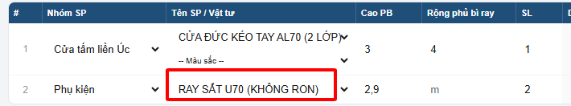

### Hình 14

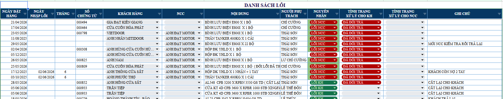

### Hình 15

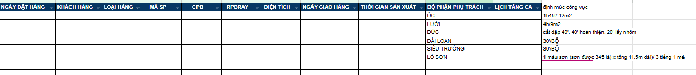

### Hình 16

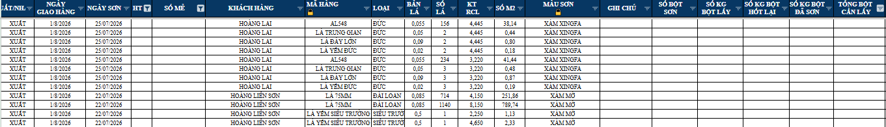

### Hình 17

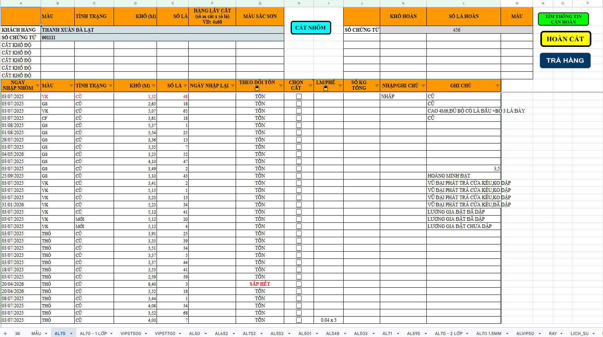
